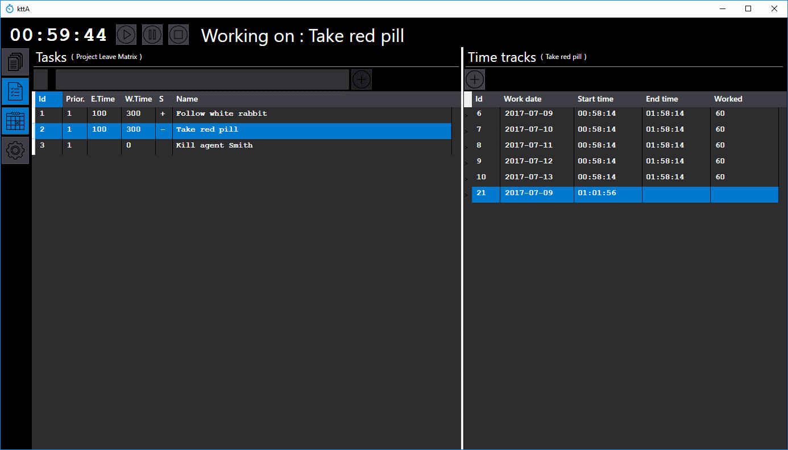
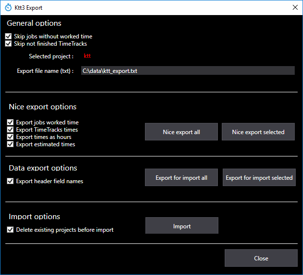
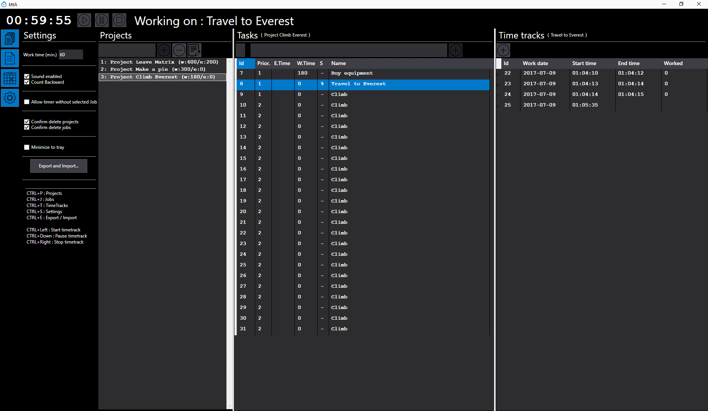
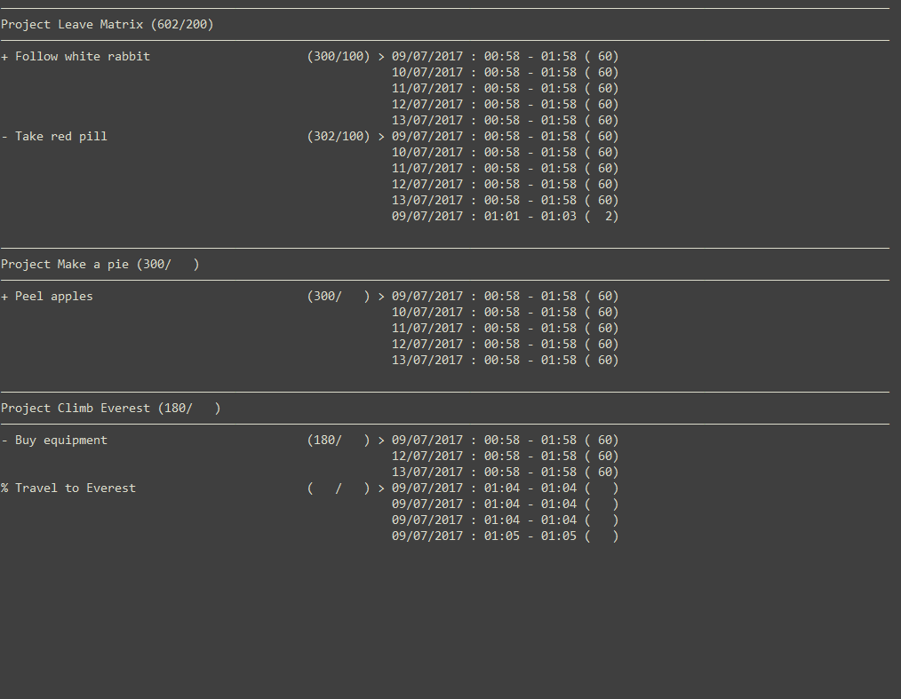
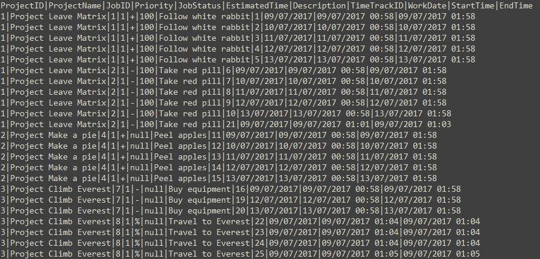

# Time-Tracking Task Manager

## Overview

The Time-Tracking Task Manager is a simple yet powerful application designed for project and task management, incorporating a Pomodoro-style timer. Developed using Windows Presentation Foundation (WPF), Microsoft Entity Framework (EF), and following the Model View ViewModel (MVVM) pattern, this application serves as a personal productivity tool with a focus on time tracking and project management.

## Background

Originally created as an experimental project to explore WPF, EF, and MVVM, the Time-Tracking Task Manager evolved into a practical solution for managing projects and tracking task times. The inspiration for this project stemmed from the desire to integrate task time tracking into a Pomodoro timer, differentiating it from existing tools like YAPA. While the application may not adhere perfectly to MVVM principles, it serves its purpose effectively and is continually refined based on personal needs.

## Key Features

- Pomodoro timer with configurable time intervals.
- Forward and backward time tracking options.
- Projects consist of tasks, each with its own set of work times (time tracks).
- Export data to text files in a user-friendly format or a CSV-style for backup and Excel import.
- Flexible control over estimated times, task status, and priorities, customizable on a per-project basis.
- Minimalistic timer mode available for simple time tracking without project/task management.
- Tray icon with the current Pomodoro timer displayed in the tooltip.
- Sound notifications (borrowed from YAPA) can be enabled or disabled.
- Panel states, widths, and the active project are remembered between sessions.
- Rustic appearance (as acknowledged by the developer).

## How to Compile

- Developed using Visual Studio 2017 Professional; simply clone and open the .sln file.
- Modify the "mdffiledir" in "App.config" for database file location or adjust the "ktt3Connection" connection string.
- Run "Update-Database -ProjectName ktt3 -Verbose -Force" in the package manager console to create the initial EF database.
- Ensure MSSQLLocalDB or SQLServer Express is installed; download [here](https://www.microsoft.com/en-us/download/details.aspx?id=29062).
- Additional information on SqlLocalDB can be found [here](https://docs.microsoft.com/en-us/sql/database-engine/configure-windows/sql-server-2016-express-localdb).

## Known Issues

- Minor issues exist, such as delayed refreshing of calculated fields and a display anomaly when the last working project is the first in the list.

## Credits and Acknowledgments

- Utilizes the Hardcodet.NotifyIcon.Wpf package by Philipp Sumi for tray icon integration.
- Styles adapted from xml files of [MahApps.Metro](https://github.com/MahApps/MahApps.Metro).
- INotifyPropertyChanged implementation sourced from the [PRISM](https://msdn.microsoft.com/en-us/library/ff648465.aspx) project.
- Icons obtained from [flaticon](http://www.flaticon.com/).
- Community support from [stackoverflow](https://stackoverflow.com/).

## Contribution and Bug Reporting

- Bug reports can be submitted on GitHub issues or via private message.
- Contributions are welcome, but potential contributors are encouraged to reconsider their life choices. Submit pull requests for consideration.

## Screenshots

- 
- 
- 
- 
- 
